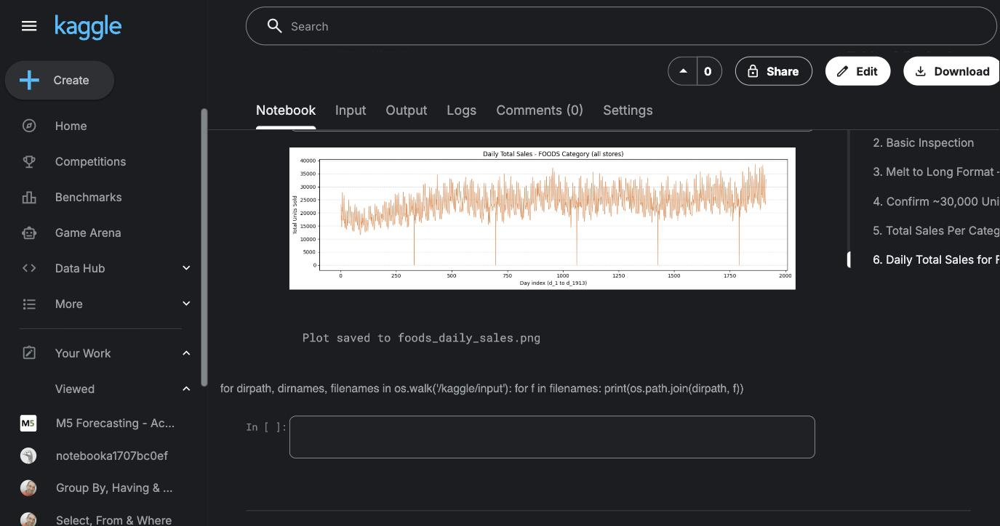

# M5 / CPG Sales Forecasting — EDA & Baselines

Exploratory data analysis and baseline forecasting on the **M5 (Walmart) retail dataset** — hierarchical daily unit sales for thousands of CPG products across stores. This notebook reshapes the raw competition data, profiles demand patterns, and establishes **baseline forecast scores (by WMAPE)** that any machine-learning model has to beat.

It's the EDA + baseline foundation for a fuller CPG demand-forecasting pipeline (XGBoost / LightGBM / Prophet).

---

## Daily FOODS sales



Clear upward trend with strong **weekly seasonality** — the pattern the baselines (and later ML models) need to capture.

## What the notebook does

| Step | Detail |
|------|--------|
| **Load** | `sales_train_validation.csv` (M5 wide format: one row per item·store, one column per day) |
| **Reshape** | Melt wide → long, yielding **~30,000 unique (item, store) series** |
| **Profile** | Total sales per category; daily total sales for the FOODS category |
| **Eval setup** | Hold out the final days as a forecast horizon; split last training day vs. evaluation window |
| **Baseline 1** | **Last-Value (Naïve)** — carry the last observed value forward |
| **Baseline 2** | **Seasonal-Naïve** — repeat the value from one weekly period earlier |
| **Score** | **WMAPE** (Weighted Mean Absolute Percentage Error) comparison across the two baselines |
| **Findings** | Key observations, results summary, and next steps |

## Why baselines + WMAPE matter

In demand forecasting, a model is only useful if it beats a cheap baseline. Seasonal-Naïve is a deceptively strong benchmark on weekly-seasonal retail data, so scoring it with **WMAPE** (the volume-weighted error metric used in retail/CPG, robust to the many low-volume series) defines the bar an ML model must clear — and stops "looks-impressive-but-worse-than-naïve" models from sneaking through.

## Run it

```bash
# Get the M5 data (sales_train_validation.csv) from the Kaggle
# "M5 Forecasting - Accuracy" competition, place it next to the notebook, then:
pip install pandas numpy matplotlib jupyter
jupyter notebook m5_eda.ipynb
```

## Tech

`Python · pandas · NumPy · matplotlib · Jupyter · time-series forecasting · WMAPE`

## Next steps

- Feature engineering (calendar effects, price, rolling lags, promotions)
- Gradient-boosted models (**LightGBM / XGBoost**) and **Prophet**, benchmarked against these baselines by WMAPE
- Hierarchical reconciliation across the item → store → category levels

---

*Part of an ongoing CPG demand-forecasting portfolio. Dataset: [M5 Forecasting – Accuracy (Kaggle)](https://www.kaggle.com/competitions/m5-forecasting-accuracy).*
